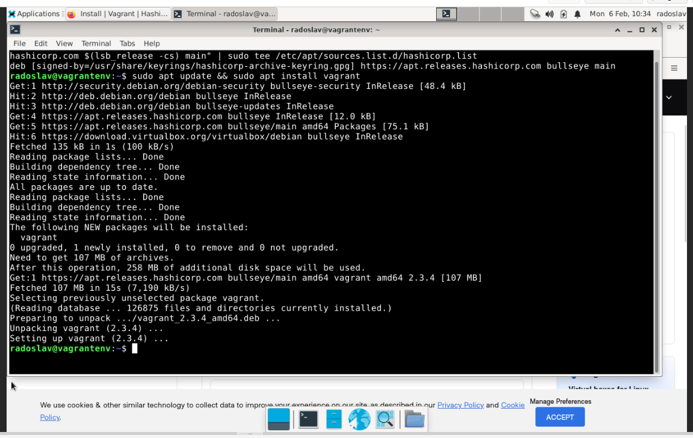
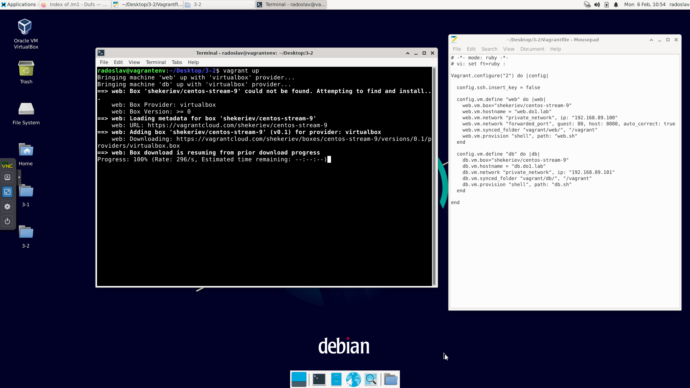
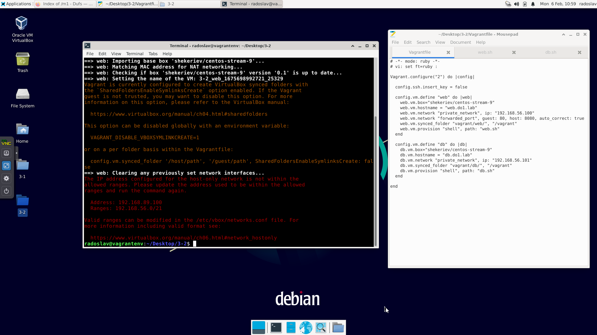
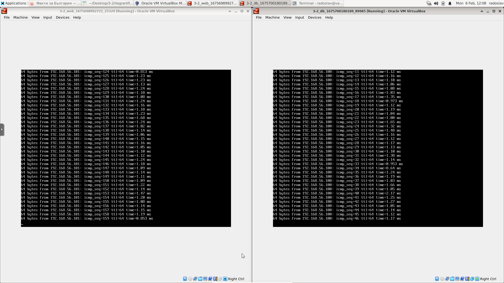
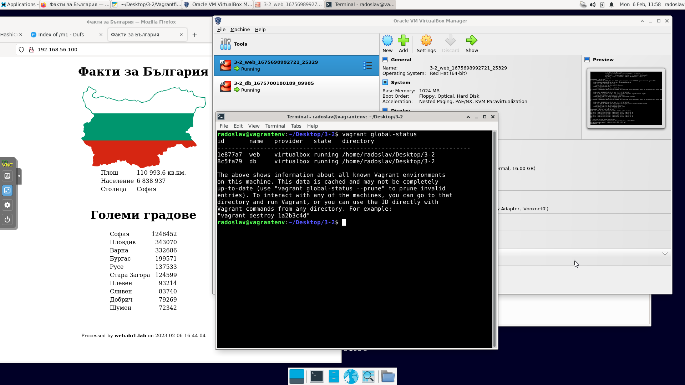

# Упражнение М1 3-2


## Средата
В домашния си homelab използвам Proxmox на сървъра ми за виртуализация. Поради тази причина, правя упражненията в отделни виртуални машини. В случая ще използвам Debian 11 с включена Nested Virtualization.

## Стъпки
1.	Създаване на средата – стандартна инсталация на Debian 11
2.	Инсталиране на Virtualbox
Следвах инструкциите от Linux_Downloads – Oracle VM VirtualBox
    
    1.	Добавих източниците към /etc/apt/sources.list със следната команда:

        ```bash
        sudo echo “deb [arch=amd64 signed-by=/usr/share/keyrings/oracle-virtualbox-2016.gpg] https://download.virtualbox.org/virtualbox/debian bullseye contrib” >> /etc/apt/sources.list
        ```

    2.	Свалих нужните ключове:

        ```bash
        wget -O- https://www.virtualbox.org/download/oracle_vbox_2016.asc | sudo gpg --dearmor --yes --output /usr/share/keyrings/oracle-virtualbox-2016.gpg
        ```

    3.	Инсталирах Virtualbox 7:

        ```bash
        sudo apt update && sudo apt install virtualbox-7.0 -y
        ```

3.	Инсталиране на Vagrant

    Следвах инструкциите от Install | Vagrant | HashiCorp Developer

    ```bash
    wget -O- https://apt.releases.hashicorp.com/gpg | gpg --dearmor | sudo tee /usr/share/keyrings/hashicorp-archive-keyring.gpg

    echo "deb [signed-by=/usr/share/keyrings/hashicorp-archive-keyring.gpg] https://apt.releases.hashicorp.com $(lsb_release -cs) main" | sudo tee /etc/apt/sources.list.d/hashicorp.list

    sudo apt update && sudo apt install vagrant -y
    ``` 

    

4.	Свалих и разархивирах файловете за упражнението във виртуалната машина.
5.	`cd Desktop/3-2/`
6.	`vagrant up`

    

<center>* * *</center>

> ❗ Възникна грешка свързана със събнета. Наложи се да променя IP-тата във Vagrant файла и в другите два скрипта. От 192.168.89.0/24 на 192.168.56.0/24 
>
> 

<center>* * *</center>

> Инсталацията и сетъп-а на двете машини завърши без други грешки. 
> При изпълнение на `vagrant global-status` излизат и двете машини. Логнах се в тях, за да видя дали се виждат.
>  
> 

<center>* * *</center>

> При отваряне на браузъра, страницата излиза и данните от базата данни се зареждат успешно.
>  
> 

<center>* * *</center>

## Историята с команди:

```bash
sudo apt update && sudo apt upgrade -y && sudo apt autoremove -y

sudo apt install qemu-guest-agent

sudo echo "deb [arch=amd64 signed-by=/usr/share/keyrings/oracle-virtualbox-2016.gpg] https://download.virtualbox.org/virtualbox/debian bullseye  contrib" >> /etc/apt/sources.list

cat /etc/apt/sources.list

clear

wget -O- https://www.virtualbox.org/download/oracle_vbox_2016.asc | sudo gpg --dearmor --yes --output /usr/share/keyrings/oracle-virtualbox-2016.gpg

sudo apt-get update && sudo apt install virtualbox-7.0 -y

clear

wget -O- https://apt.releases.hashicorp.com/gpg | gpg --dearmor | sudo tee /usr/share/keyrings/hashicorp-archive-keyring.gpg

clear

echo "deb [signed-by=/usr/share/keyrings/hashicorp-archive-keyring.gpg] https://apt.releases.hashicorp.com $(lsb_release -cs) main" | sudo tee /etc/apt/sources.list.d/hashicorp.list

sudo apt update && sudo apt install vagrant -y

vagrant

cd Desktop/3-2/

vagrant up
```