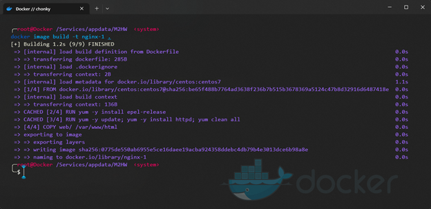
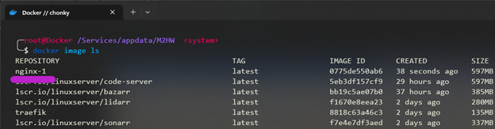
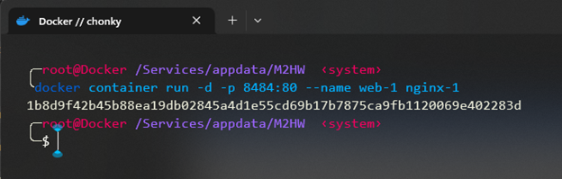
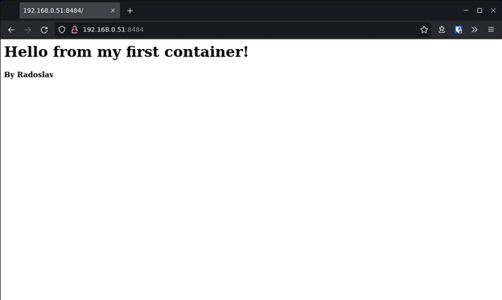

# Упражнение М2 

## Средата
Ще използвам една от виртуалните машини, която вече има инсталиран Docker Engine – Community, v23.0.0. Виртуалната машина е с Debian11, 4c / 16GB RAM / 128GB storage.
Стъпки

1.	Създавам нужните директории

    ```bash
    mkdir /Services/appdata/M2HW && cd /Services/appdata/M2HW
    
    mkdir web
    ```

2.	Създавам нужните файлове
    
    ```bash
    touch web/index.html
   
    cat "<h1>Hello from my first container!</h1><h4>By Radoslav</h4>" > web/index.html

    touch Dockerfile && nano Dockerfile
    ```

3.	Съставям Dockerfile според инструкциите:
    
    ```Dockerfile
    FROM centos:centos7
    LABEL maintainer="Radoslav" version="1.0"
    RUN yum -y install epel-release
    RUN yum -y update; yum -y install httpd; yum clean all
    COPY web/ /var/www/html
    ENTRYPOINT ["/usr/sbin/httpd","-D", "FOREGROUND"]
    EXPOSE 80
    ```

4.	Building the image:
    
    ```bash
    docker image build -t nginx-1 .
    ```
    
    

5.	Проверявам за image:
    
    

6.	Стартирам контейнера:
    
    ```bash
    docker container run -d -p 8484:80 --name web-1 nginx-1
    ```

    
 
7. Проверка на сайта:

    

## Историята с команди:

```bash
docker version

clear

mkdir /Services/appdata/M2HW && cd /Services/appdata/M2HW

mkdir web

touch web/index.html

cat "<h1>Hello from my first container!</h1><h4>By Radoslav</h4>" > web/index.html

touch Dockerfile

nano Dockerfile

docker image build -t nginx-1 .

docker image ls

clear

docker container run -d -p 8484:80 --name web-1 nginx-1

```