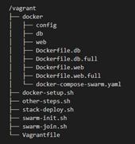
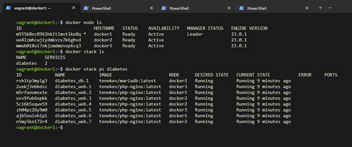

# Упражнение М3 

## Средата
* Работя във виртуална машина с 4c / 16GB RAM / 128GB storage. 
* Windows 11 22H2
* Vagrant 2.3.4
* VirtualBox 7.0.6

## Стъпки

### ⭐ Създаване на VMs с Vagrant и Provisioning
Използвах предоставения от практиката Vagrantfile в debian/3. Създадох няколко нови скрипта за provision:

* swarm-init.sh
* swarm-join.sh
* stack-deploy.sh

Скриптa **swarm-init.sh** се изпълняват на **docker1** и той се превръща в мениджъра. На **docker2** и **docker3** си изпълнява само **swarm-join.sh** и те стават работници.
Скрипта **stack-deploy.sh** се изпълнява едва след като се стартира последната машина.

### ⭐ Синхронизирани папки във Vagrant

> ❗ Възползвам се от синхронизираната папка на Vagrant, за да споделям информация (swarm_token) между отделните машини:

На **docker1**:
```bash
docker swarm join-token -q worker > /vagrant/swarm_token
```

На **docker2** и **docker3**:
```bash
token=$(cat "/vagrant/swarm_token")
```

### ⭐ Предаване на аргументи към скриптова във Vagrant
> ❗ Възползвам се от `args:` аргумента при изпълнение на скриптове във Vagrant файла, за да вкарам нужните променливи в скриптовете. Така избягвам hardcoding където мога. Променливите са IP адресите на мениджъра и на нодовете.
```bash
# /bin/bash swarm-init.sh <self_ip>
docker1.vm.provision "shell", path: "swarm-init.sh", args: "192.168.99.101"
     . . .
# /bin/bash swarm-join.sh <self_ip> <manager_ip>
docker2.vm.provision "shell", path: "swarm-join.sh", args: "192.168.99.102 192.168.99.101"
     . . .
docker3.vm.provision "shell", path: "swarm-join.sh", args: "192.168.99.103 192.168.99.101"
```

Въз основа на тези забележки, swarm скриптовете изглеждат така:

**swarm-init.sh** на **docker1**
```bash
#!/bin/bash

self=$1
echo "* Initializing swarm ..."
docker swarm init --advertise-addr $self
docker swarm join-token -q worker > /vagrant/swarm_token
```

**swarm-join.sh** на **docker2** и **docker3**
```bash
#!/bin/bash

token=$(cat "/vagrant/swarm_token")
self=$1
manager=$2
echo "* Joining swarm ${token:0:50} ..."
docker swarm join --token $token --advertise-addr $self $manager:2377
```

### ⭐ Стартиране на стак в края на provisioning
За да разпределя тасковете между различните нодове, вдигам стака след като всички машини са се присъединили към клъстъра. Използвам *trigger*, за да изпълня **stack-deploy.sh** от **docker1** – мениджъра. 

```yaml
config.vm.define "docker3" do |docker3|
    . . .
    docker3.trigger.after :up do |trigger|
        trigger.run = {"inline": "vagrant ssh docker1 -c '/vagrant/stack-deploy.sh'"}
    end
end
```

**stack-deploy.sh** на **docker1**
Преди да се вдигне стака, трябва да се създадат нужните  тайни и те да са достъпни от целия клъстър. Вдигам стак, с леко модифициран frontend и моя база данни.

```bash
#!/bin/bash

stack_name=diabetes

echo "* Deploying stack $stack_name"
echo '12345' | docker secret create db_root_password -
docker stack deploy -c /vagrant/docker/docker-compose-swarm.yaml $stack_name
echo "* Removing temp token file"
rm -f /vagrant/swarm_token
```

## Създаване на Stack за Docker Swarm

### ⭐ Build and push images

* Използвам `shekeriev/bgapp` като boilerplate. 
* Към него прибавям `TrafeX/docker-php-nginx`, защото ме мързи и го променям за нуждите си. Имаше нужда да се добави `apk add php81-pdo_mysql`
* Промених `./db/db_setup.sql` с моя таблица.
* Промених `./web/index.php` за да отразява таблицата.

Създадох и качих двата image-а в DockerHub:

```bash
docker login -u tenekev -p none_of_your_business

docker image build -t tenekev/php-nginx -f Dockerfile.web . \
&& docker image push tenekev/php-nginx

docker image build -t tenekev/mariadb -f Dockerfile.db . \
&& docker image push tenekev/mariadb
```

### ⭐ Файлова структура и разпределение на файловете
При създаването на Image-ите, не включвам в тях `./db/` и `./web/`. До последно работех по `index.db` и не ми се занимаваш с build + push всеки път. Вместо това, нужните директории се закачат към контейнерите чрез `docker-compose-swarm.yaml`.

```yaml
services:
  web:
    . . .
    volumes:
      - "/vagrant/docker/web:/var/www/html"

  db:
    . . . 
    volumes:
      - "/vagrant/docker/db/db_setup.sql:/docker-entrypoint-initdb.d/init.sql"
```

> ❗ За да може всички нодове в клъстъра да виждат нужните файлове, съм ги постави в синхронизираната `/vagrant` папка. Така избягвам да ги включвам в image-ите, за по-лесни промени. В същото време, контейнерите създадени на **docker2** и **docker3** виждат файловете във `/vagrant/docker/web`
Ако се налага файловете да се включени, може да се ползва `Dockerfile.db.full` и `Dockerfile.web.full`. 

Ето така изглежда синхронизираната папка от някоя от виртуалните машини: 




### Проверка на стака:
> Сложих повече реплики, за да съм сигурен, че ги разгръща върху всички нодове
>
> 

> Проверка дали сайта работи
> 
> 